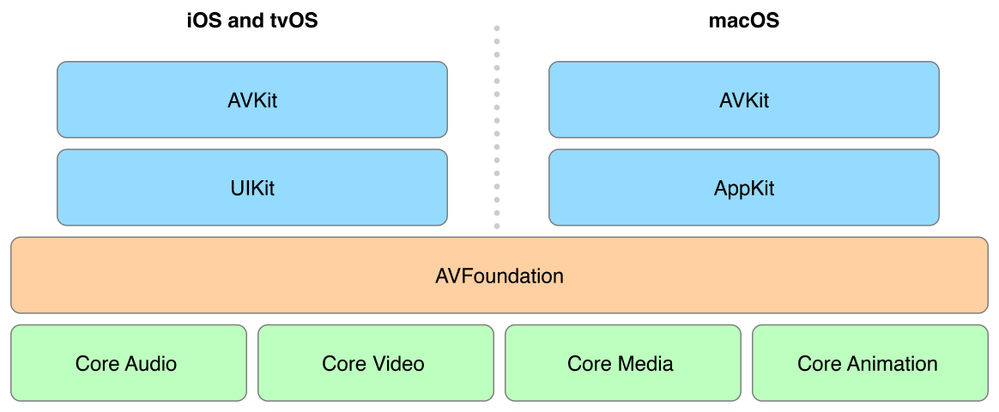
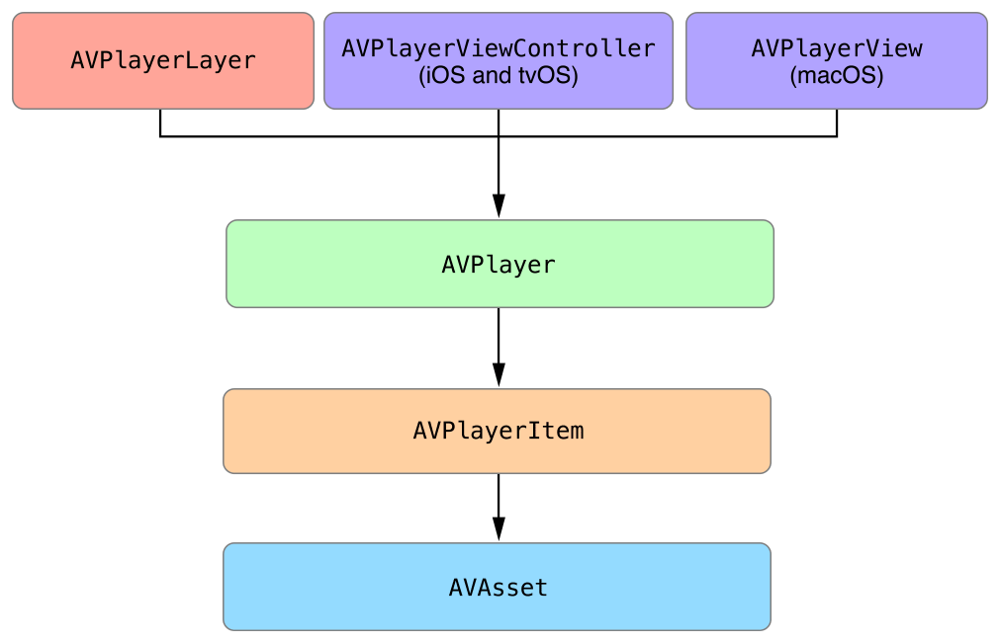
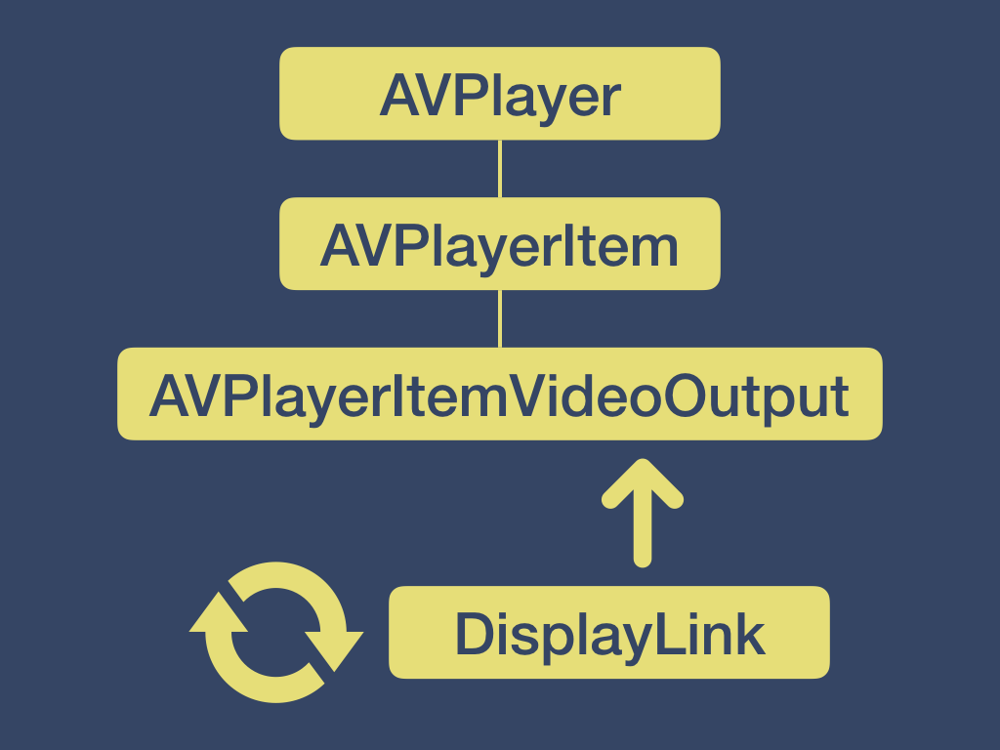
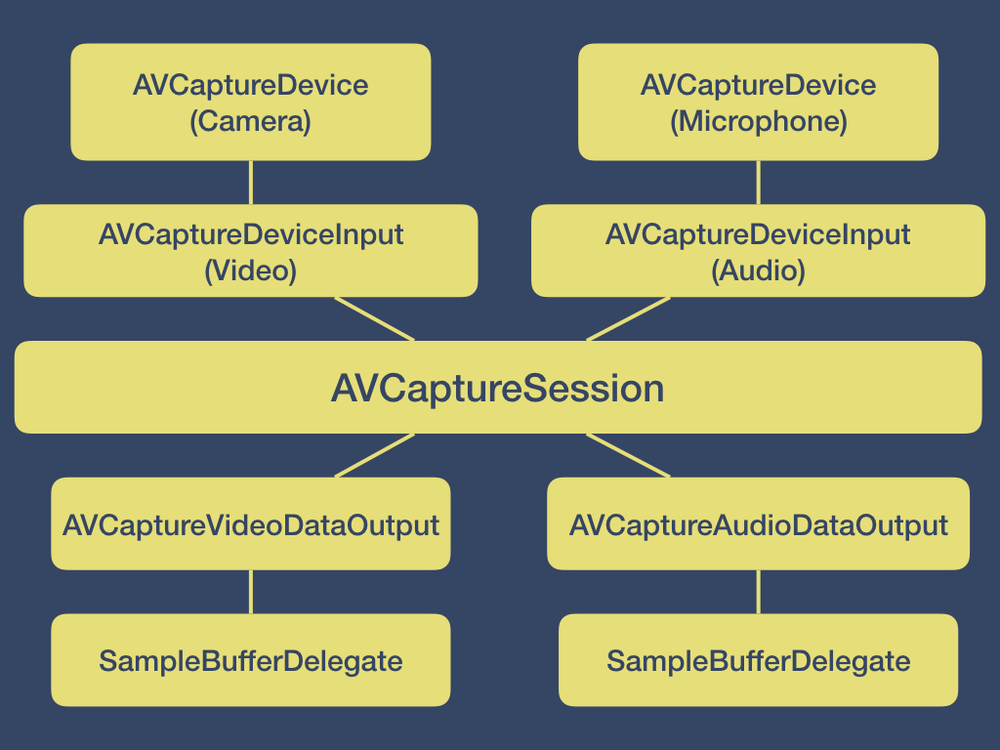
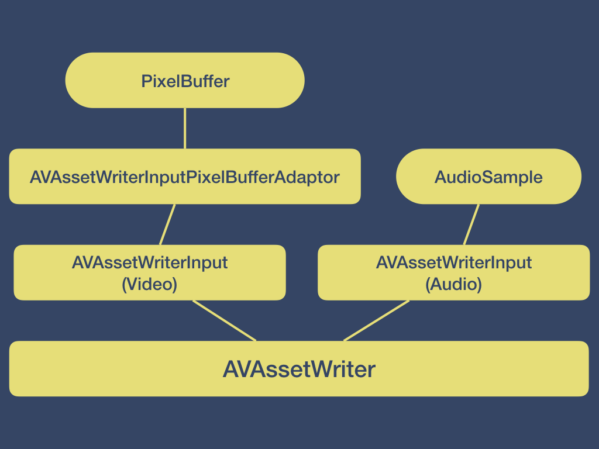
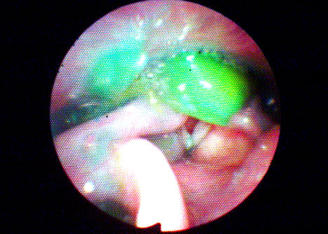

autoscale: true
slidenumbers: true
footer: AVFoundation and You -- github.com/jaylyerly/AVFoundation -- jayl@oakcity.io -- Nov 2017
theme: Next


# [fit] AVFoundation and You
<br>
##Jay Lyerly
###CTO, Oak City Labs
###jayl@oakcity.io
###@jaylyerly

[.hide-footer]
[.slidenumbers: false] 
---

# What is AVFoundation?
<br>

> AV Foundation is the full featured framework for working with time-based audiovisual media on iOS, macOS, watchOS and tvOS.
-- developer.apple.com

---

# AVFoundation 



---

# Things We Skip

 - Thumbnails
 - Temporal editing (Final Cut Pro, etc)
 - Reencoding
 - Audio APIs
 - AirPlay
 - Speech Synthesis

^ We can use some of the techniques here for re-encoding, but there are some other tools in AVFoundation to make it easy for common formats.

^ I'm mostly going to talk about video and some about audio in the context of video, but there are simpler apis for audio only stuff.

^ AVCapturePhotoOutput (iOS)

^ Probably some other stuff that I'm missing

---

# [fit] The Important Stuff

<br>

# :tv: Playing Video :tv:

# :movie_camera: Recording Video :movie_camera:

---

## [fit] :tv: Playing Video :tv:

---

# AVKit / AVFoundation



---

# Demo 1 - Off the Rack

- 5 minutes to video playback

---

# Demo 2 - Add Some _Style_

- Add custom controls
- Keep AVPlayerView/ViewController
   - AirPlay
   - PiP (iOS)
   - Media Trimming (macOS)
   - Content Proposals
   - Interstitials

---

# Demo 3 - Full *DIY* 


---

# Demo 3 - Full *DIY* 

- Drop AVPlayerView
- Harvest pixel data from AVPlayer
    - Driven by DisplayLink
- Display with Metal

---

# Demo 3 - Full *DIY* 



^ Talk about display link
^ go to demo

---

# Demo 3 - Full *DIY* 


### Why Core Image?

- Easy to work with 
    - Easy to combine or filter
    	- Visual effects
    	- Analysis
    - High performance
    - Cross platform
    - Easy to record

^ Also use metal for display for similar reasons.
^ Metal is high performance and cross platform

---

# [fit] Background Reading - AVAssetReader

```swift 
let asset = AVAsset(url: assetUrl)
let videoTrack = asset.tracks(withMediaType: AVMediaTypeVideo).last 
let videoOutput = AVAssetReaderTrackOutput(track: videoTrack, ....)

let reader = AVAssetReader(asset: asset) 
reader.add(videoOutput)
reader.startReading()

while reader.status == .reading {
    autoreleasepool {
        if let sampleBuffer = videoOutput.copyNextSampleBuffer() {
        	// do something with sample buffer
        }
    }
}
```

^ Read as fast as possible
^ Might use for re-encoding
^ Frame by frame analysis -- use Vision API for image recognition

---

## [fit] :movie_camera: Recording Video :movie_camera:

^ Who has done some video recording?

---

# Demo 5 - My First Recorder

AVCaptureView (macOS)


---

# Demo 4 - The Quickening

- CaptureController 
   - Coordinate capture from an AVCaptureDevice
   - Deliver a CIImage
- RecordController
   - Create a movie file
   - Receive CIImage to append as movie frames

---
# Demo 4 - CaptureController



---

# Demo 4 - RecordController



---

# [NDŌʜᴅ](https://ndohd.com) 


---

# [NDŌʜᴅ](https://ndohd.com) 



---

# Demo

--- 

# [fit] AVFoundation and You
<br>
[github.com/jaylyerly/AVFoundation](https://github.com/jaylyerly/AVFoundation)
###Jay Lyerly
###jayl@oakcity.io
###@jaylyerly

[.hide-footer]
[.slidenumbers: false] 
